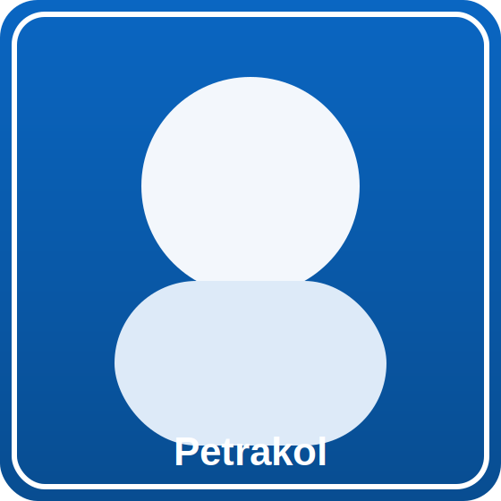

<h1 align="center">Petrakol — AI Founder | VC Investor | Product Architect</h1>

<table>
  <tr>
    <td width="220" valign="top">
      
    </td>
    <td valign="top">
      
<strong>Mission:</strong> Build practical AI products and back founders turning ambitious ideas into measurable outcomes.

      
<strong>Current focus:</strong> applied AI ventures, product architecture, and investor-operator support.

      
<strong>Call to action:</strong> If you are building in AI and want to collaborate, invest, or scale execution, let’s connect.

    </td>
  </tr>
</table>

## Highlights

- Launched multiple AI-native product experiments from concept to production-ready MVPs.
- Expanded investment activity across applied AI and vertical software operators.
- Published and open-sourced repeatable product execution frameworks for founder teams.
- Built ScopeBench to make AGI-agent aspiration and termination logic auditable.

<svg width="100%" height="110" viewBox="0 0 960 110" xmlns="http://www.w3.org/2000/svg" role="img" aria-label="Milestones timeline">
  <line x1="70" y1="55" x2="890" y2="55" stroke="#0A66C2" stroke-width="6"/>
  <circle cx="140" cy="55" r="12" fill="#0A66C2"/>
  <circle cx="380" cy="55" r="12" fill="#0A66C2"/>
  <circle cx="620" cy="55" r="12" fill="#0A66C2"/>
  <circle cx="840" cy="55" r="12" fill="#0A66C2"/>
  <text x="95" y="25" fill="#0A66C2" font-size="18">2023</text>
  <text x="300" y="25" fill="#0A66C2" font-size="18">2024</text>
  <text x="545" y="25" fill="#0A66C2" font-size="18">2025</text>
  <text x="785" y="25" fill="#0A66C2" font-size="18">2026</text>
  <text x="55" y="92" fill="#111111" font-size="14">AI product systematisation</text>
  <text x="300" y="92" fill="#111111" font-size="14">Investment thesis expansion</text>
  <text x="555" y="92" fill="#111111" font-size="14">ScopeBench launch</text>
  <text x="730" y="92" fill="#111111" font-size="14">Global founder collaborations</text>
</svg>

## Pinned Projects

- [**ScopeBench**](https://github.com/petrakol/ScopeBench) 
  - A benchmark concept for enforceable AGI-agent aspiration and termination behavior.
- [**ai-hedge-fund**](https://github.com/petrakol/ai-hedge-fund) 
  - A collaborative AI hedge fund team project focused on strategy and automation.
- [**Steam-Game-Review-Scraper**](https://github.com/petrakol/Steam-Game-Review-Scraper) 
  - Extracts reviews and user metadata for game analytics and sentiment workflows.
- [**bulk-downloader-for-reddit**](https://github.com/petrakol/bulk-downloader-for-reddit) 
  - Archives Reddit content for long-term research and dataset building.
- [**text-preprocessing-techniques**](https://github.com/petrakol/text-preprocessing-techniques) 
  - Demonstrates practical NLP preprocessing pipelines in Python.
- [**blockXpand**](https://github.com/petrakol/blockXpand) 
  - Experimental project exploring scalable app architecture patterns.

## GitHub Stats

> Updated every 6 hours, Europe/Prague. Dynamic SVGs are generated by `.github/workflows/metrics.yml` on the `output` branch.

  
  

  
  

  

## Tech & Contact

<strong>Visual identity:</strong> LinkedIn blue <code>#0A66C2</code> as primary accent, neutral dark text <code>#111111</code>, and white for contrast. Badge style is unified as <code>for-the-badge</code>.

  

  
  
  

## Other Projects

- [blockXpand](https://www.blockxpand.com)
- [WhyNot Capital](https://www.whynotcapital.com)
- [LinkedIn profile](https://www.linkedin.com/in/pkolesarova/)

## How metrics are generated

The profile metrics are generated by the GitHub Actions workflow in `.github/workflows/metrics.yml`. To tweak cards, plugins, cadence, or theme/palette, edit that workflow and run **workflow_dispatch**.
